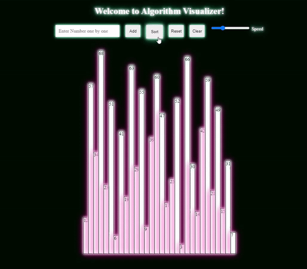

# Algorithm Visualizer

Welcome to Algorithm Visualizer! This project allows you to visualize the bubble sort algorithm by rendering an array of numbers as a set of div elements on a webpage.

You can access the website via [this link](https://callmeamartya.github.io/algorithm-visualizer/sorting.html)

## Features

- Append numbers to the array
- Sort the array using the bubble sort algorithm
- Reset the array to default values
- Clear the array
- Adjust the animation speed of the sorting process

## Usage

1. Enter a number between 1 and 70 in the input box.
2. Click the "Add" button to append the number to the array.
3. To sort the array, click the "Sort" button. The sorting process will be visualized with animated bars representing the numbers.
4. Click the "Reset" button to reset the array to its default values.
5. Use the "Clear" button to empty the array.
6. Adjust the animation speed by moving the slider in the "Speed" section.

## Installation

1. Clone this repository to your local machine.
2. Open the index.html file in your web browser.

## Technologies Used

- HTML
- CSS
- JavaScript

## Upcoming Features

- Support for more sorting algorithms (e.g., selection sort, insertion sort)
- Bug fixes and performance improvements
- Enhanced user interface and customization options
- Additional algorithms for visualization (e.g., searching algorithms, graph algorithms)
